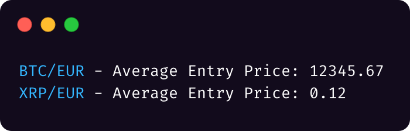

# Kraken-Entry-Price

Utility to get the entry buy price for each coin that you hold on Kraken.

Export your trades in https://www.kraken.com/u/history/export*, save the file to the project dir and then do `python3 avg.py`.

I don't know if this actually calculates correct results, lmk if it doesn't.

*the old website is the only one with an actually useful export function, the new one is completely broken.